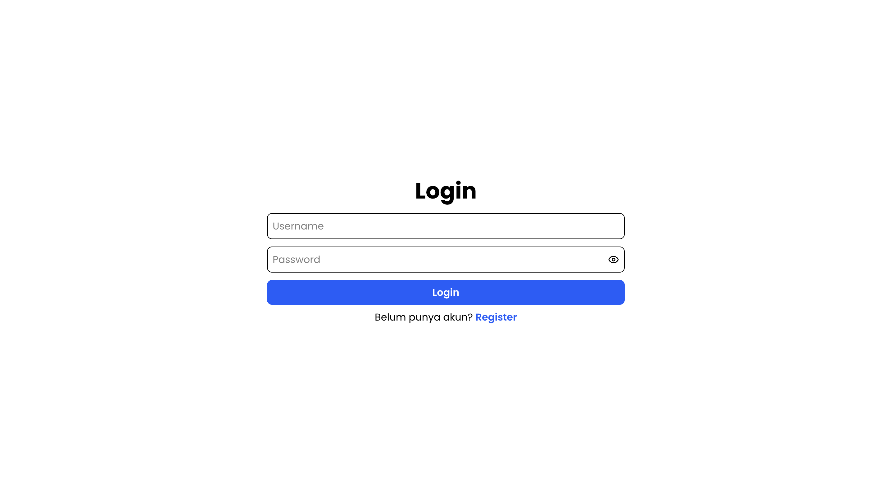
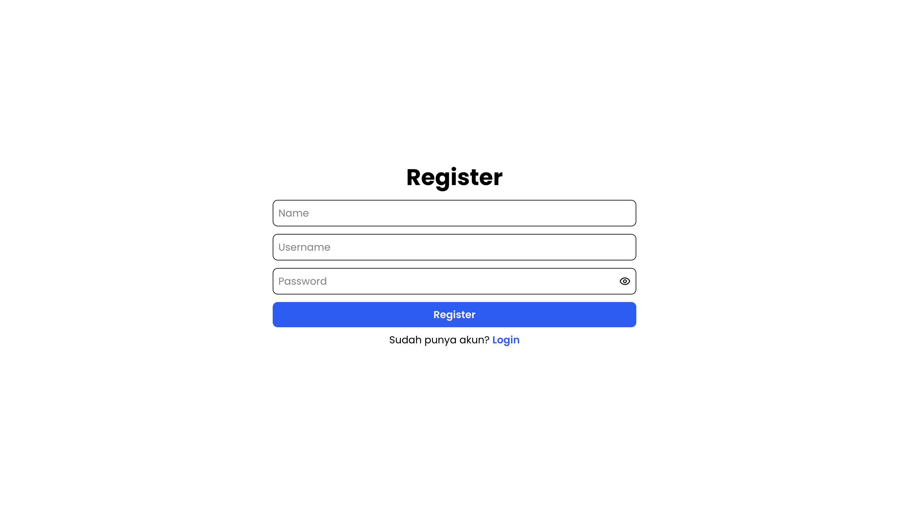
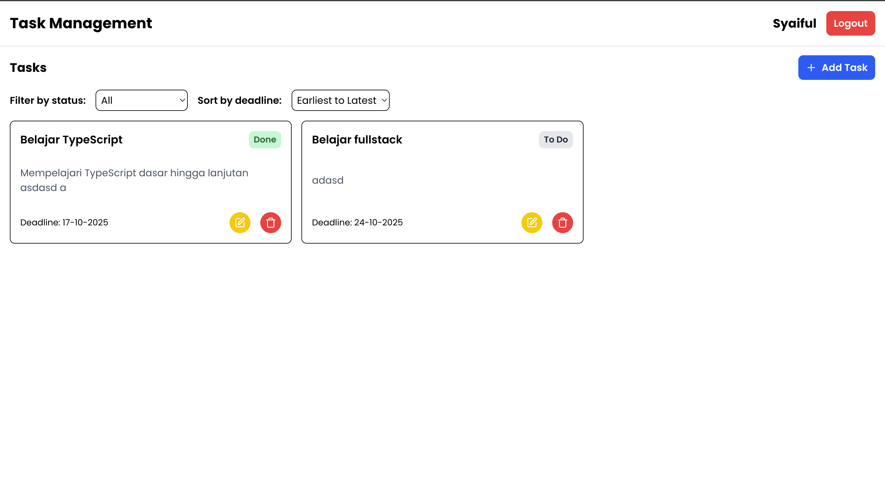
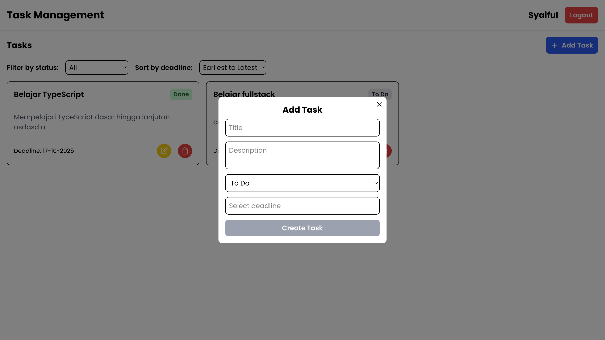
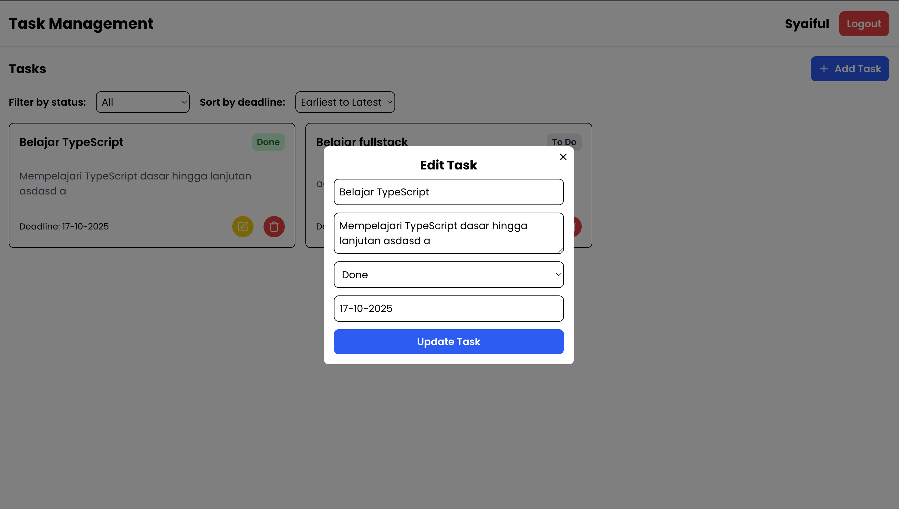

# Task Management App

## Deskripsi

Task Management App adalah aplikasi untuk membantu user mengelola tugas. User dapat melihat, membuat, mengupdate, dan menghapus tugas dengan mudah. User juga dapat memfilter berdasarkan status dan mengurutkan berdasarkan deadline.

## Teknologi yang Digunakan

- **Backend:** Node.js, Express, TypeScript, MySQL
- **Frontend:** React (Vite), TypeScript, Tailwind
- **Database:** MySQL

## Langkah Menjalankan

### Backend

1. Install dependencies:
   ```bash
   cd backend
   npm install
   ```
2. Buat file `.env`:
   ```bash
    DB_HOST=localhost
    DB_USER=root
    DB_PASSWORD=password
    DB_NAME=task_management
    PORT=5000
    JWT_SECRET=
    JWT_EXPIRES_IN=
    BCRYPT_SALT_ROUNDS=
   ```
3. Jalankan server:

```bash
npm run dev
```

### Frontend

1. Install dependencies:
   ```bash
   cd frontend
   npm install
   ```
2. Buat file `.env`:
   ```bash
    VITE_BASE_URL=http://localhost:5000/api
   ```
3. Jalankan server:

```bash
npm run dev
```

## Login Dummy

```bash
username: syaiful
password: 123456
```

## Struktur Database

### **Tabel `users`**

| Field      | Tipe         | Null | Key | Default           | Extra             |
| ---------- | ------------ | ---- | --- | ----------------- | ----------------- |
| user_id    | int(11)      | NO   | PRI | NULL              | auto_increment    |
| name       | varchar(100) | NO   |     | NULL              |                   |
| username   | varchar(50)  | NO   | UNI | NULL              |                   |
| password   | varchar(255) | NO   |     | NULL              |                   |
| created_at | timestamp    | YES  |     | CURRENT_TIMESTAMP | DEFAULT_GENERATED |

---

### **Tabel `tasks`**

| Field       | Tipe                               | Null | Key | Default | Extra          |
| ----------- | ---------------------------------- | ---- | --- | ------- | -------------- |
| task_id     | int(11)                            | NO   | PRI | NULL    | auto_increment |
| user_id     | int(11)                            | NO   | MUL | NULL    |                |
| title       | varchar(150)                       | NO   |     | NULL    |                |
| description | text                               | YES  |     | NULL    |                |
| status      | enum('To Do','In Progress','Done') | YES  |     | To Do   |                |
| deadline    | date                               | YES  |     | NULL    |                |
| created_by  | varchar(255)                       | NO   |     | NULL    |                |

---

## Tampilan Utama






